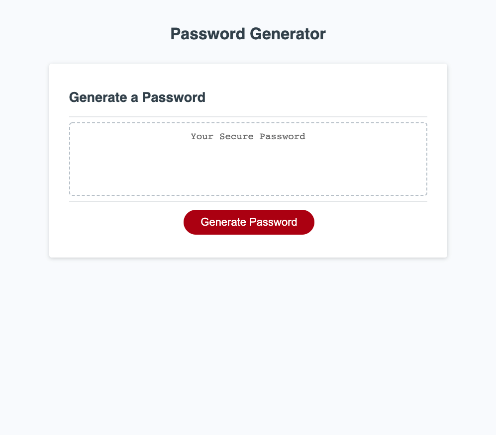

# hw3-passwords

## Motivation

Creating a secure password seems like it would be easy to do off the top of your head, but there are many ways people can guess passwords these days even using computer programs designed to do so. The need for a secure password is more important than ever these days, and this program will help you do that by completely randomly generating a list of characters. People often use simple things that they can remember and have meaning to them, and therefore can be easy to guess. If you truely want a secure password, this web application will create one for you. Just be sure to remember it! Or store it somewhere secure.

## What to expect when using this program:

You will be prompted with questions regarding the contents of the password that you would like generated; length, uppercase, lowercase, symbols, and numbers. The program requires at least one character type and for your length to be between 8 and 128 characters long to ensure true security. The program will not create a password outside of these parameters.

### Link to deployed website:

https://elliscj.github.io/hw3-passwords/

### Screenshot

## License

MIT License

Copyright (c) [2021] [Cameron Ellis]

Permission is hereby granted, free of charge, to any person obtaining a copy
of this software and associated documentation files (the "Software"), to deal
in the Software without restriction, including without limitation the rights
to use, copy, modify, merge, publish, distribute, sublicense, and/or sell
copies of the Software, and to permit persons to whom the Software is
furnished to do so, subject to the following conditions:

The above copyright notice and this permission notice shall be included in all
copies or substantial portions of the Software.

THE SOFTWARE IS PROVIDED "AS IS", WITHOUT WARRANTY OF ANY KIND, EXPRESS OR
IMPLIED, INCLUDING BUT NOT LIMITED TO THE WARRANTIES OF MERCHANTABILITY,
FITNESS FOR A PARTICULAR PURPOSE AND NONINFRINGEMENT. IN NO EVENT SHALL THE
AUTHORS OR COPYRIGHT HOLDERS BE LIABLE FOR ANY CLAIM, DAMAGES OR OTHER
LIABILITY, WHETHER IN AN ACTION OF CONTRACT, TORT OR OTHERWISE, ARISING FROM,
OUT OF OR IN CONNECTION WITH THE SOFTWARE OR THE USE OR OTHER DEALINGS IN THE
SOFTWARE.
